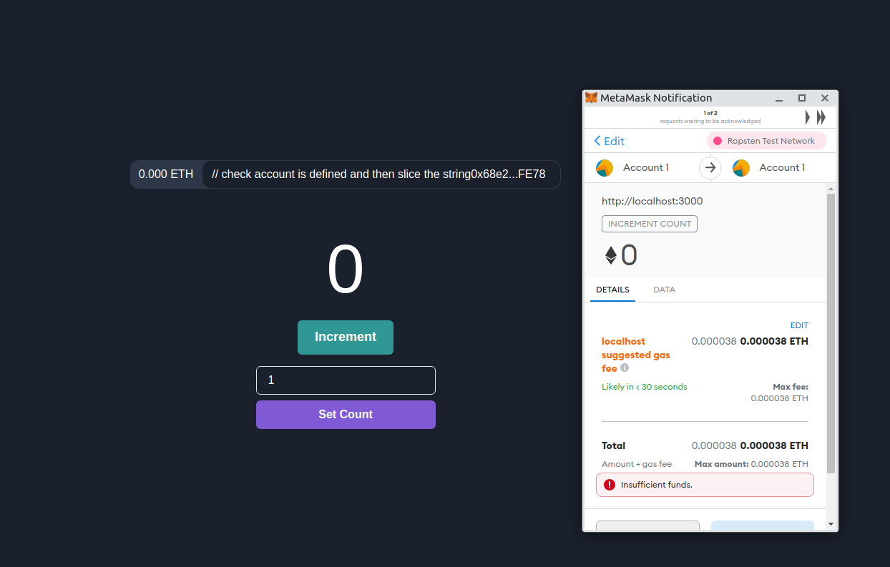

<h2>Ethereum Portfolio</h2>

<pre>
  * Web3, Solidity, React, Typescript
</pre>

<h3>:gear: Getting started</h3>

1. Clone project.
2. Install MetaMask using this site (https://metamask.io/)
3. Install required dependencies with `yarn install`. 
4. Run project using `npm start` command
5. Deploy using `yarn build` command.